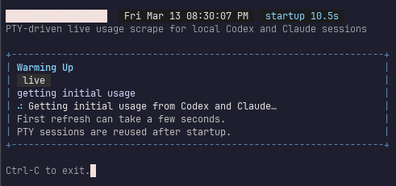
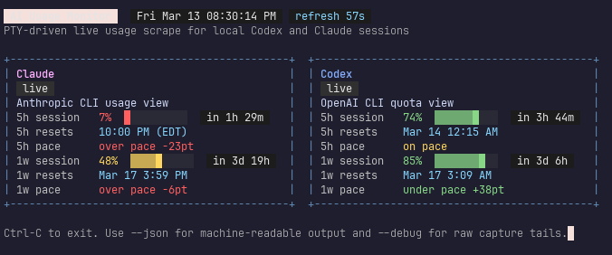

# ai_monitor

Real-time terminal monitor for local `codex`, `claude`, and `gemini` CLI usage.

This project uses the same core shortcut as [`steipete/CodexBar`](https://github.com/steipete/CodexBar): it launches your locally authenticated CLI inside a PTY, sends `/status` or `/usage`, strips terminal control sequences, parses the rendered panel, and refreshes on a timer. Gemini now also has a direct internal quota probe fallback because its `/stats` TUI was not stable enough to scrape reliably.





## Features

- Monitors Codex usage via `/status`
- Monitors Claude usage via `/usage`
- Monitors Gemini usage via `/stats`
- Reuses persistent PTY sessions to reduce refresh latency after startup
- Refreshes every 120 seconds by default
- Shows Codex and Claude 5-hour and 1-week session usage, reset times, and pace indicators
- Shows Gemini Flash and Pro pool remaining percentages with reset countdowns
- Uses a shared provider card renderer so reset labels and pacing rows stay aligned across providers
- Canonicalizes reset displays to one local format across provider-specific strings
- Renders a compact grid dashboard optimized for terminal use
- Exposes `--json` output for scripting and automation, including normalized reset display fields
- Includes parser tests for representative Codex and Claude output

## Requirements

- Python 3.10+
- `codex` installed and authenticated on your `PATH`
- `claude` installed and authenticated on your `PATH`
- `gemini` installed and authenticated on your `PATH`
- A terminal that supports ANSI color

## Run

```bash
python3 -m ai_monitor
./monitor
```

Useful options:

```bash
python3 -m ai_monitor --once
python3 -m ai_monitor --interval 30
python3 -m ai_monitor --interval 60
python3 -m ai_monitor --json
python3 -m ai_monitor --debug
./monitor --once
```

When `--debug` is enabled, raw PTY captures are also written to `/tmp/ai_monitor_codex_capture.txt`, `/tmp/ai_monitor_claude_capture.txt`, and `/tmp/ai_monitor_gemini_capture.txt`.

## How It Works

1. Start a persistent PTY-backed session for each CLI.
2. Send `/status` to Codex and `/usage` to Claude.
3. Probe Gemini through the installed CLI's internal quota/config path, with PTY `/stats` as a fallback.
4. Capture the rendered terminal output or structured quota payload.
5. Strip ANSI/control sequences and normalize the text.
6. Parse usage percentages and reset windows.
7. Re-render the dashboard on the chosen refresh interval.

This is intentionally a CLI/TUI scraping approach, not an official provider API integration.

## Output

Each provider card shows:

- `5h session`: remaining usage for the current 5-hour window
- `5h resets`: next 5-hour reset time
- `5h pace`: whether current usage is ahead of or behind the window pace
- `1w session`: remaining usage for the current 1-week window
- `1w resets`: next weekly reset time
- `1w pace`: weekly pace indicator

Reset displays are normalized before rendering:

- Same-day resets render as `h:mm AM/PM`
- Future resets render as `Mon DD h:mm AM/PM`
- Relative vendor text like `Resets in 2h 14m` is converted into the same absolute local display

## JSON Output

`--json` preserves the raw provider payload under `data` and adds normalized reset display fields under `display`.

Example:

```json
{
  "updated_at": "2026-03-14T08:22:30",
  "providers": [
    {
      "name": "Codex",
      "ok": true,
      "source": "cli",
      "data": {
        "five_hour_reset": "Resets 13:16",
        "weekly_reset": "Resets on Mar 18, 9:00AM"
      },
      "display": {
        "five_hour_reset_display": "1:16 PM",
        "weekly_reset_display": "Mar 18 9:00 AM"
      },
      "error": null
    }
  ]
}
```

## Notes

- `codex` is launched with `-s read-only -a untrusted --no-alt-screen` to keep the probe conservative.
- `claude` is launched in an interactive PTY and the probe auto-accepts the folder trust prompt if it appears.
- `gemini` prefers a direct internal quota probe against the installed Gemini CLI and only falls back to PTY `/stats` scraping if that direct path fails.
- The first refresh is slower because the local CLI sessions need to start and render their initial TUI state.
- After startup, the monitor reuses those PTY sessions to make subsequent refreshes faster.

## Limitations

- This depends on the current terminal output format of the `codex`, `claude`, and `gemini` CLIs.
- If any vendor changes its TUI wording or layout, the parser may need to be updated.
- Reset windows are only shown when the CLI output exposes them.
- Terminal rendering can vary across fonts and terminal emulators.

## Known Issues

- **Claude `/usage` may return "only available for subscription plans"** even on valid Team or Pro seats. This is a server-side issue where the Anthropic usage API returns empty limit buckets (`five_hour`, `seven_day`, `seven_day_sonnet` are all null). The PTY probe itself works correctly. When the API starts returning data again, the Claude card will populate automatically.
- Gemini prefers a direct internal quota probe and only falls back to PTY `/stats` scraping if that path is unavailable.

## Validation

```bash
python3 -m unittest discover -s tests -v
```
